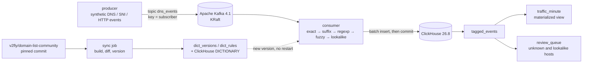

# App Tagging Stream

Tag network hostname events to applications and categories as they stream through **Apache Kafka**, store them in **ClickHouse**,
and keep the hostname dictionary current from a public, versioned source.



## What is real and what is synthetic

| Part | Source |
|---|---|
| Hostname dictionary | **Real**: [v2fly/domain-list-community](https://github.com/v2fly/domain-list-community) (MIT), pinned to an upstream commit on every sync. 5,015 rules for 23 global services in the snapshot used for the numbers below |
| Indonesian apps | A small supplement in [`dictionary/local_id.yaml`](dictionary/local_id.yaml) for 16 apps missing upstream (Tokopedia, Gojek, Grab, Traveloka, DANA, OVO, BCA, Mandiri, BRI, Vidio, Mobile Legends, and others), brand domains only |
| Events | **Synthetic**: generated from the dictionary with random user ids and regions. No subscriber or operator data is used |

## How a hostname is tagged

| Step | Example | Confidence |
|---|---|---|
| exact (`full:` rule) | `static.siege-amazon.com` → primevideo | 1.0 |
| longest matching suffix | `r5---sn-abc.googlevideo.com` → youtube (more specific than google) | 0.98 |
| regexp, keyword | upstream patterns | 0.95, 0.8 |
| fuzzy: a brand next to infrastructure words | `images.tokopedia-static.net` → tokopedia | 0.6 |
| **lookalike**: a brand next to bait words | `netflix-account-verify.xyz` → no app, sent for review | – |
| unknown | `netflix-news.com`, `grabbag.com` → no app, sent for review | – |

When a domain appears in several upstream lists, the specific list wins over an umbrella list that includes it (`googlevideo.com` is
YouTube, not Google). Unknown and lookalike hosts land in `review_queue` with hit counts and volume, so the dictionary grows from
evidence instead of guesses.

## Results (synthetic, 100,000 labelled events)

| | Precision | Recall |
|---|---|---|
| With fuzzy | **100%** | **96.6%** |
| Without fuzzy | 100% | 90.5% |

Exact and subdomain hosts are all tagged correctly; every lookalike is flagged; third-party sites using a brand name
(`netflix-news.com`) are never tagged as the brand. The cost of that caution is recall on unusual legitimate domains: only about 5%
of held-out variants such as `netflixtv.com` are recognised, and the rest wait in the review queue. The streaming path reproduces the
offline numbers exactly when measured from ClickHouse (see `sql/queries.sql`).

These numbers measure the rules on generated data, not accuracy on real traffic. The evaluation includes host patterns that were not
used to design the rules, because the first version scored 100%/100% only by being tested against its own patterns.

## What the tests found

| Found | Fix |
|---|---|
| Upstream has rules for brand TLDs (`.youtube`, `.amazon`, `.gmail`); subdomains of them were never checked | Suffix walk includes the last label |
| `appletree.com` tagged as Apple | A brand glued to another word counts only if the rest is an infrastructure word or a number |
| Google and Amazon variants missed, because their names also appear in other apps' rules | App names always belong to their own app |
| Generator labelled `static.siege-amazon.com` as Amazon; upstream has a more specific rule for Prime Video | Ground truth follows the most specific rule |
| First evaluation scored 100%/100% against its own patterns | Held-out hard variants and hard negatives |
| Committing an empty batch fails with `_NO_OFFSET` (librdkafka mock cluster) | Commit only after a processed batch |
| Consumer stopped before the group rebalance finished and read nothing | Idle time counted from partition assignment |
| An example query failed in ClickHouse: an alias shadowed the column it aggregated | Aliases renamed; every query in `sql/queries.sql` runs in the test environment |

## Delivery semantics

At-least-once. The consumer inserts a batch into ClickHouse and commits Kafka offsets only after the insert succeeds; on failure the
batch is read again. A crash between insert and commit can store an event twice, so every event carries an `event_id` and duplicates
are measurable (`count() - uniqExact(event_id)`). Events are keyed by subscriber, so one user's events stay in order on one partition.

## Run it

```bash
docker compose up -d --build              # Kafka, ClickHouse, dictionary sync, producer (300 events/s), consumer
docker compose --profile ui up -d         # optional Kafka UI at http://localhost:8085
docker compose up -d --scale consumer=3   # one consumer per partition
```

ClickHouse is published on host port 8124 (8123 is often taken by another local ClickHouse); change it with `CH_HTTP_PORT=...`.

Then open the ClickHouse console at http://localhost:8124/play (user `apptag`, password `apptag`) and run the queries in
[`sql/queries.sql`](sql/queries.sql): traffic per category, share per tagging method, the review queue, live precision and recall,
dictionary versions, and SQL lookups through the ClickHouse DICTIONARY. The dictionary is re-synced every 6 hours; the consumer picks
up a new version within 30 seconds without a restart.

Without Docker: `pip install -e ".[dev]"`, then `apptag --v2fly <path-to-v2fly>/data eval`.

## Tests

`pytest` runs 22 tests: unit tests on a small MIT-licensed v2fly fixture, and integration tests that send events through a Kafka
mock cluster (librdkafka's in-process brokers) into a real ClickHouse server: completeness and materialized-view totals, hot dictionary
reload, review queue contents, and no event loss when a ClickHouse insert fails mid-stream. CI runs them against a ClickHouse service
container.

## Limitations

- Single Kafka broker, no TLS or SASL, demo credentials in Compose (all ports bound to 127.0.0.1).
- The ClickHouse DICTIONARY source stores the demo password in its definition; use a dedicated read-only user in real deployments.
- The Indonesian supplement covers 16 apps with brand domains only; CDN and API domains of those apps rely on fuzzy matching or review.
- Hostnames come from DNS, SNI or HTTP headers; encrypted DNS and ECH hide them, which this project does not address.

## Background

The problem comes from my work on application tagging for a mobile operator. This is a new implementation on public and synthetic
data; no employer code, data, rules or host lists are included.

## License

MIT. Includes data from v2fly/domain-list-community (MIT); see [NOTICE](NOTICE).
